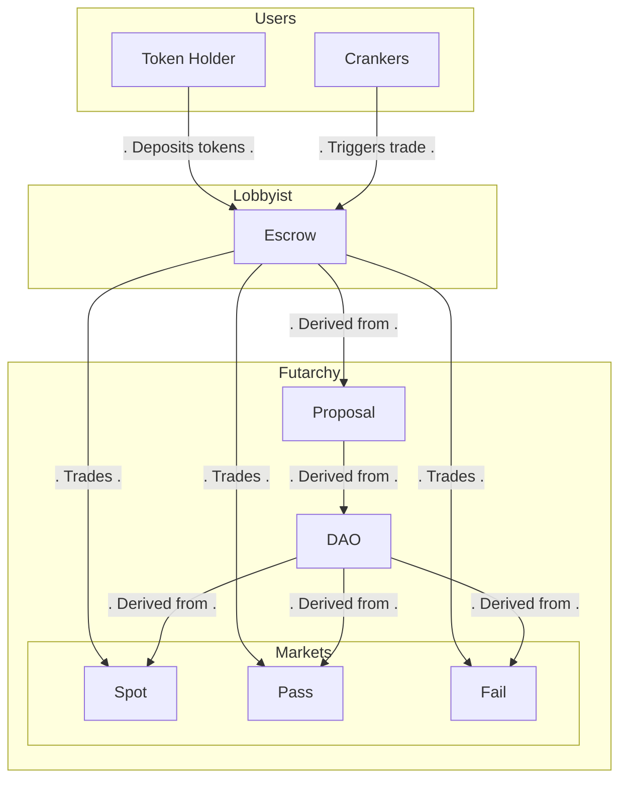

## Lobbyist Program

A Solana program that automates trading [MetaDAO](https://metadao.fi/)'s decision markets based on user preferences.

### High-level Architecture

Token holders of a given futarchy can deposit tokens into an escrow they created, providing their relative preferences. Crankers can then come in and permissionlessly trigger trades from the escrow, earn a small fee doing so.



### Development

Prereqs: Rust + Solana toolchain and dependencies already configured for this repo.

Build the program:

```bash
cargo build-sbf
```

Run tests:

```bash
cargo test -- --nocapture
```
